# 📱 iOS Swift Challenges – Challenge 1 & Challenge 3

This repository contains two Swift-based iOS mini-projects developed using **SwiftUI**. These challenges demonstrate core SwiftUI concepts, such as lists, views, navigation, and interaction with native frameworks like `AVFoundation`.

---

## 🚀 Challenge 1 – Music Player Service App

**📁 Folder:** `MusicPlayerService_challenge1`

### ✅ Features:
- Browse a list of sample music tracks
- Each track includes:
  - 🎵 Title & Artist
  - 🎨 Album Art
- Play audio using `AVFoundation`
- Smooth SwiftUI layout for browsing and playback

### 📸 Screenshots:

#### 🧩 Main File – `main.swift`
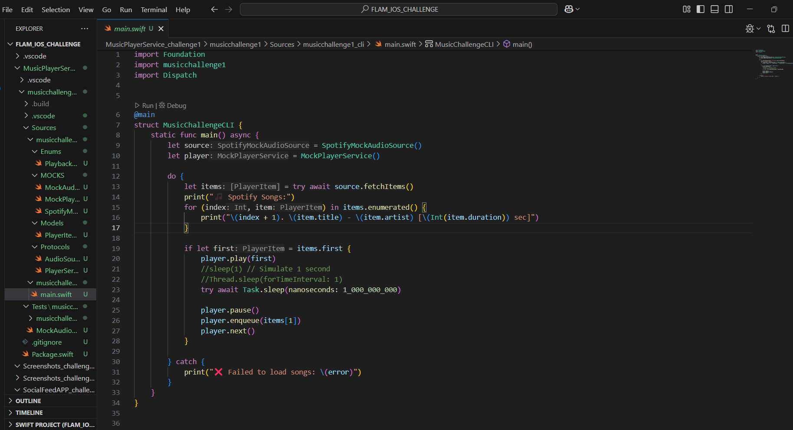

#### 🎧 Mock Audio Source – `MockAudioSource.swift`
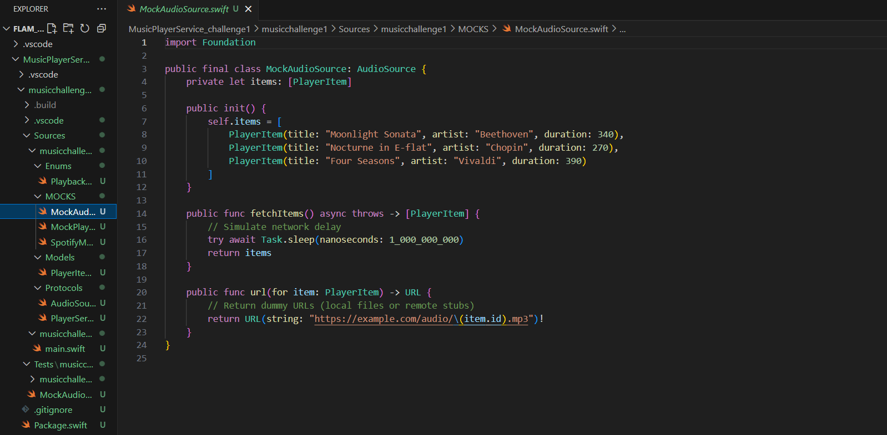

#### 🎼 Player Service – `PlayerService.swift`
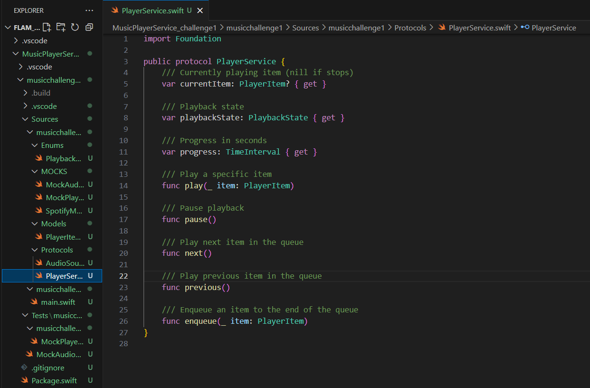

#### 🔁 Mock Player Service – `MockPlayerService.swift`
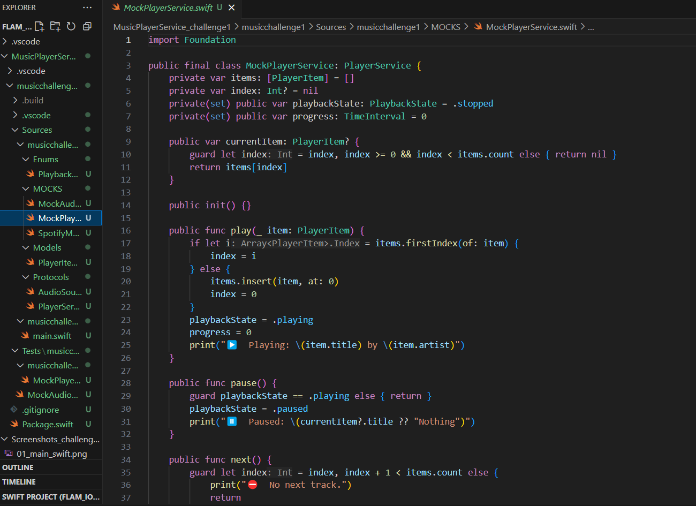

#### 🧪 Mock Audio Source Tests
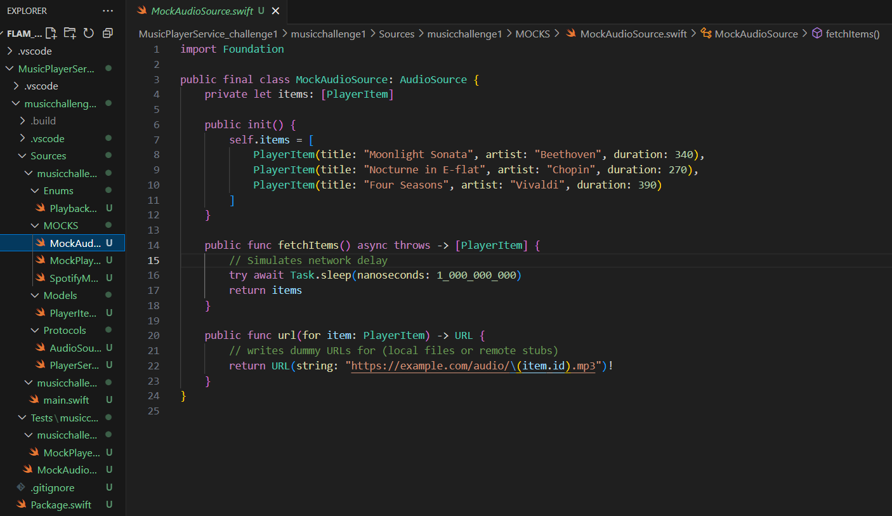

#### 💻 Terminal Output
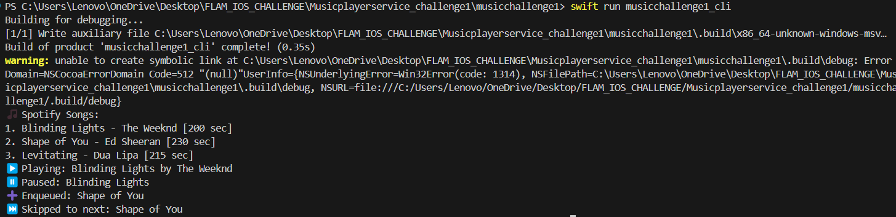

#### 📂 Project Directory Structure
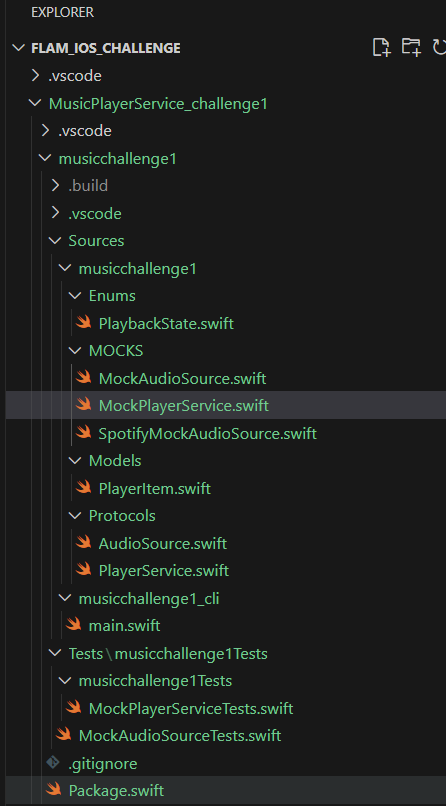

---

## 📲 Challenge 3 – Social Feed App

**📁 Folder:** `SocialFeedAPP_challenge3`

### ✅ Features:
- Feed of posts with:
  - 🧑 User name
  - 🖼️ Post image
  - ❤️ Like functionality
- Scrollable feed UI with smooth layout
- Clean component-based SwiftUI architecture

### 📸 Screenshots:

#### 🧾 Post Model – `Post.swift`
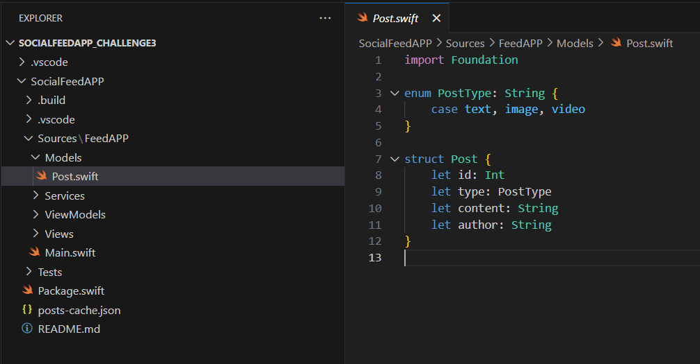

#### 🌐 Feed Service Protocol – `FeedServiceProtocol.swift`
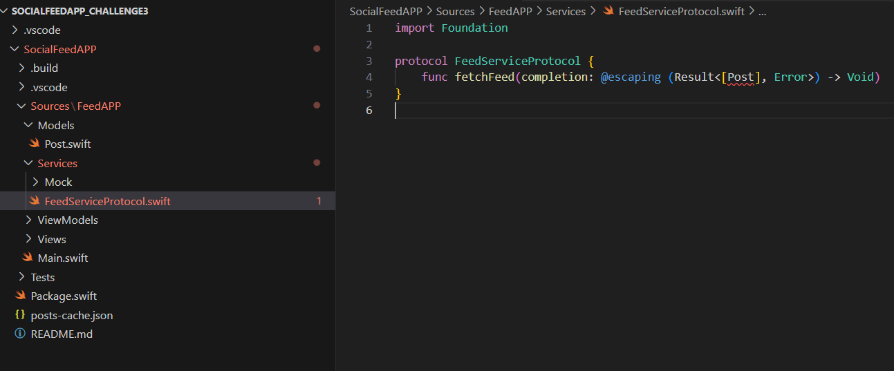

#### 📊 View Model – `FeedViewModel.swift`
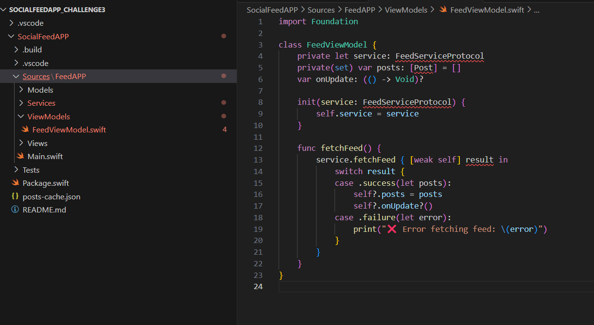

#### 🖼️ Feed View – `FeedView.swift`
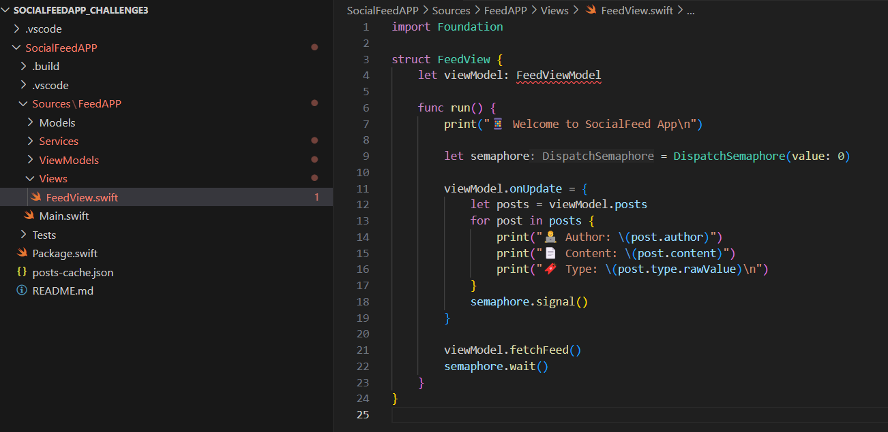

#### 🧩 Main Entry Point – `main.swift`
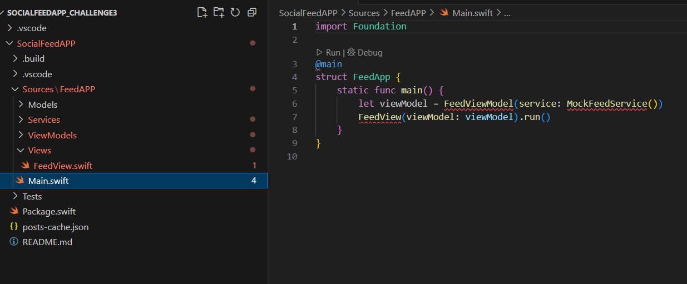

#### 🎨 Console Color Utility – `ConsoleColor.swift`
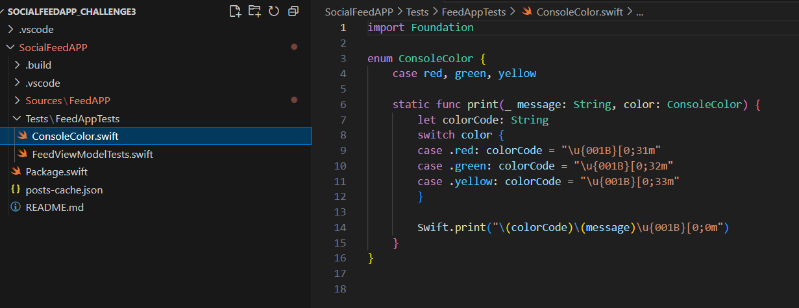

#### 🧪 ViewModel Unit Tests – `FeedViewModelTests.swift`
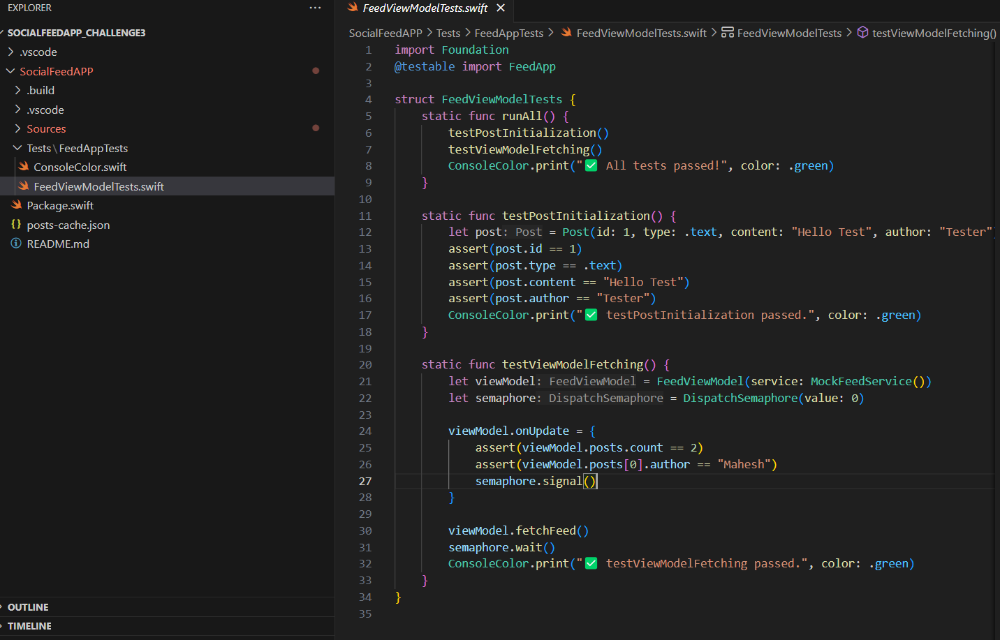

#### 📦 Swift Package Manifest – `Package.swift`
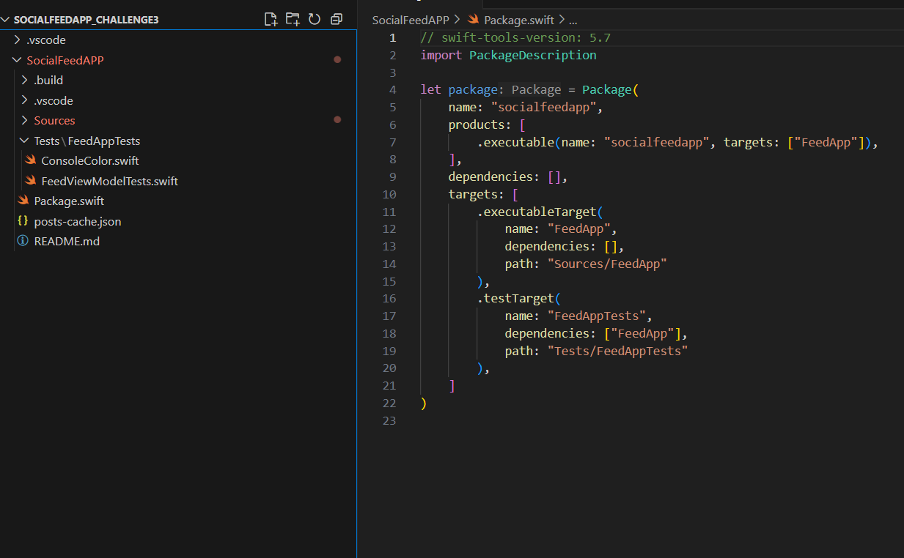

#### 💻 Terminal Output
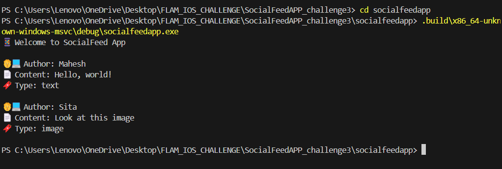

#### 📂 Project Directory Structure
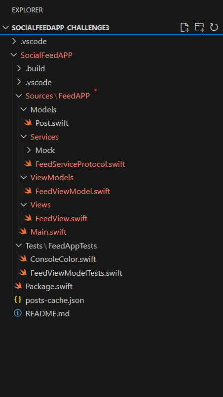

---

## 🧑‍💻 Tech Stack

- **Language:** Swift
- **Framework:** SwiftUI
- **Audio Framework (Challenge 1):** AVFoundation
- **IDE:** Xcode 14+
- **Deployment Target:** iOS 16+

---

## 👨‍💼 Author

**Mahesh Reddy Maram**  
iOS Developer | Swift & SwiftUI Enthusiast  
📧 [LinkedIn – https://www.linkedin.com/in/venkata-mahesh-reddy-maram-28039626b/]

---

## 📌 Notes

- Built for iOS developer technical challenges
- Follows clean UI/UX and component-based architecture
- You are free to fork, reuse, or improve these challenges

---
